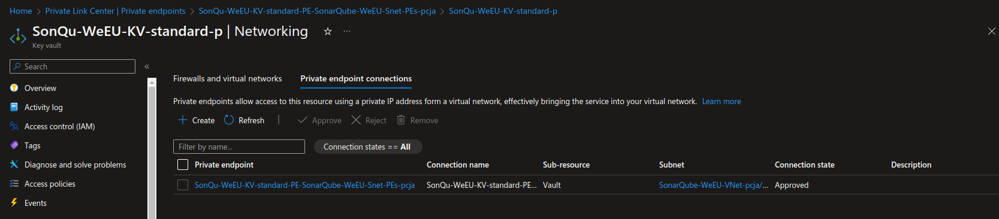
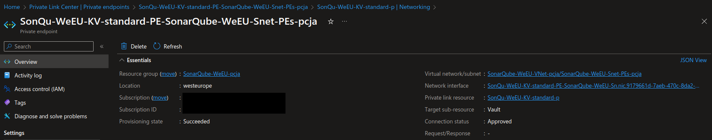

# Azure Private Endpoints for VNET Integrated Ingress


In my another [article](/blog/azure/2023-10-01-azure-public-network-firewall-access-control/) we described a Public Network Firewall Access Control. Today we will talk about Private Endpoints for VNET Integrated Ingress.

Networking is a crucial component of any cloud infrastructure. With Azure, you can design intricate network topologies that cater to various security, isolation, and connectivity needs. Today, we're going to delve into Inbound Private Networking in Azure, focusing on Azure Private Endpoints and how they facilitate secure inbound connectivity.

## What is Azure Private Endpoint?

Azure Private Endpoint is a network interface that connects you privately and securely to a service powered by Azure Private Link. The service could be an Azure service like Azure Storage, Azure Cosmos DB, SQL, Container Registry, etc., or your own Private Link Service. The connection via private endpoint uses a private IP address from your VNet, effectively bringing the service into your VNet.





## Understanding the Diagram

First let's briefly introduce involved Azure resources, then we will use a diagram to understand how various components like Azure Container Registry, Azure App Service, VNet, and Private DNS Zones interact within VNET.

#### Diagram Resources

- **Resource Group A**:
  - Container Registry
  - Private DNS Zone: `privatelink.azurecr.cn`
  - Private Link

- **Resource Group B**:
  - VNet
  - App Service
  - Private Endpoint

#### Resources Definitions

**Container Registry:** A managed Docker container registry that allows you to store and manage container images and artifacts in a secure, scalable, and efficient way. With Private Endpoints, you can securely pull images from this registry using a private IP.

**Private DNS Zone:** Azure's DNS service that allows you to use your own custom domain names rather than the Azure-provided names. In our setup, it facilitates the resolution of domain names in a VNet without the need to configure a custom DNS solution.

**Private Link:** Azure Private Link service is a way to expose your application on a private IP address in a VNet, thus isolating it from the public internet. It ensures that data transits solely over the Microsoft backbone, removing any exposure to the public internet.

**VNet (Virtual Network):** It acts as an isolated, highly-secure environment in Azure that allows Azure resources to securely communicate with each other, the internet, and on-premises networks. It is the backbone of Azure networking.

**App Service:** A fully-managed platform for building, deploying, and scaling web apps. With VNet integration, App Service can have secured and streamlined connectivity to Azure resources like databases, cache, or internal services.

**Private Endpoint:** A specific object that allows a private connection between an Azure service and a network interface in a VNet. It serves as the bridge for this private connectivity, effectively making the service part of your VNet.

#### Network Traffic Flow

```goat

    +-------------+                 +----+---+                    +----------+----------+                +--------------------+
    | App Service +--- outbound --->| VNet   +--- assosiation --->| Private Endpoint    +--- inbound --->| Container Registry |
    +-------------+                 +----+---+                    +----------+----------+                +--------------------+

```

#### Outbound connectivity from App Service to VNET

In **Resource Group B**, App Service uses integrated networking with VNET for outbound connectivity, allowing it to reach services inside the VNET.

#### Inbound connectivity from VNET to Container Registry

Then the VNet connects to a Private Endpoint which in turn links to the Container Registry in **Resource Group A**. This setup enables inbound connectivity, allowing App Service to access the Container Registry through the VNet.

#### Private DNS Zone Resolution

```goat

    +-------+   +----------------------+   +------------------+   +--------------------+
    | VNet  +-->| Private Link Connect +-->| Private DNS Zone +-->| Container Registry |
    +-------+   +----------------------+   +------------------+   +--------------------+

```

Moreover, the VNet is associated with a Private Link Connection to the Private DNS Zone. This ensures that the Container Registry is discoverable privately through DNS when accessed via the Private Endpoint.


## Terraform: Bringing It All Together

[Terraform](https://www.terraform.io/) is a popular Infrastructure as Code (IaC) tool that allows you to define and provision cloud infrastructure using a declarative configuration language. Let's see how you can set up the above architecture using Terraform:

### Terraform Code for Private Endpoint:

> NOTE:
> Your private endpoint will be integrated with the private DNS zone, ie. 'privatelink.azurewebsites.net' in the resource group of the selected subnet.
> If the private DNS zone does not exist, it will be created automatically.

```tf
resource "azurerm_private_endpoint" "this" {
  name = "${var.prefix}PE${var.subnet_name}"
  location = var.location
  resource_group_name = var.resource_group_name
  subnet_id = var.subnet_id

  private_service_connection {
    name = "${var.prefix}PSC${var.subnet_name}"
    private_connection_resource_id = var.target_resource_id
    subresource_names = [var.target_subresource_name]
    is_manual_connection = false
  }

  private_dns_zone_group {
    private_dns_zone_ids = [var.private_dns_zone_id]
    name = var.private_dns_zone_name
  }
}
```

## Conclusion

Azure's Private Networking capabilities, especially with Private Endpoints, empower businesses to build secure, efficient, and resilient network topologies. It allows services to be exposed securely over private IPs, ensuring data doesn't traverse over the internet. As businesses move towards a cloud-first approach, understanding and leveraging these features is crucial.

Remember, while tools like Terraform make it easier to define and deploy such infrastructures, always ensure that you understand the underlying components and their interactions.

Stay tuned for more deep dives into Azure's myriad of offerings!


---

> Author: [Robert Grzelka](https://robertgrzelka.pl)
> URL: https://robertgrzelka.pl/blog/azure/2023-10-01-azure-private-endpoint/

