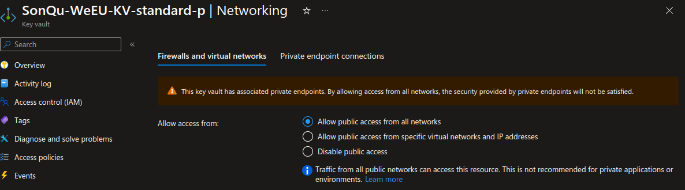
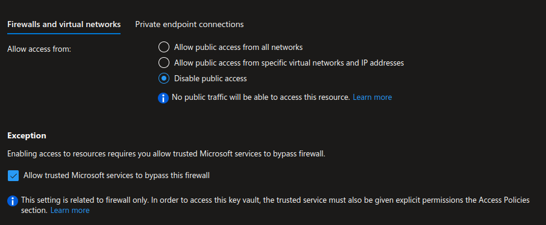
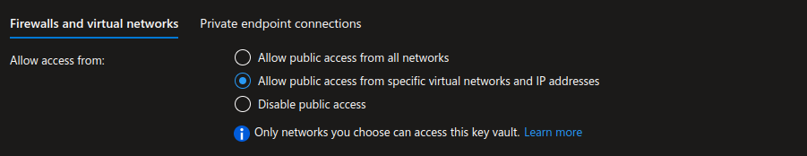
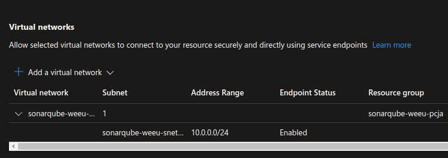
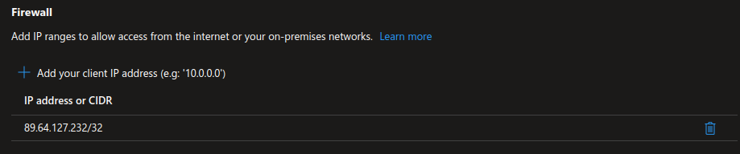
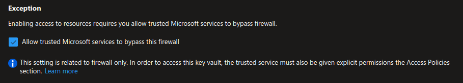
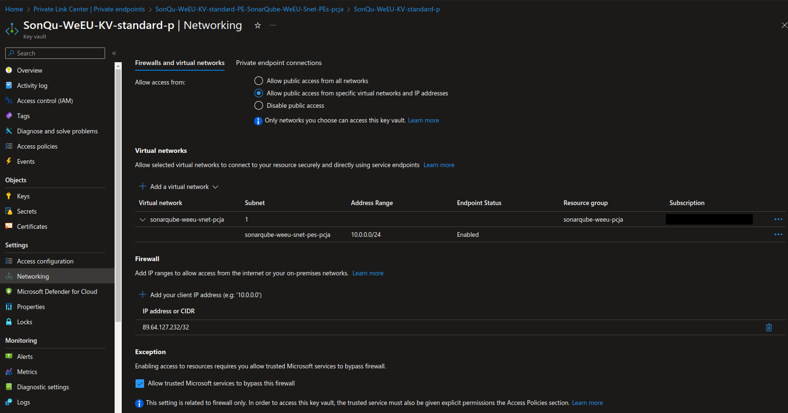

# Azure Public Network Firewall Access Control from VNET Subnets and IP Addresses


> In my another article [](/blog/azure/2023-10-01-azure-private-endpoint/) we described a Private Endpoints for VNET Integrated Ingress. Today we will talk about Public Network Firewall Access Control from VNET Subnets and IP Addresses.

In today's digital age, within the vast ecosystem of Azure, security stands out as one of the most pressing concerns for developers and system administrators alike. As organizations increasingly migrate their assets to the cloud, ensuring their protection becomes an absolute necessity. A critical component of this protective infrastructure is the Azure Key Vault. So, how can we guarantee that only the right entities can access it?


## Allow public network access from all networks

By default, Azure Key Vault is designed to be accessible over a public network. In simpler terms, anyone armed with the correct credentials can reach it, regardless of their location. While this offers a high degree of convenience, it may not always be the safest route.



## Disable public network access

On the flip side, turning off public network access implies that only those resources which are part of the same VNET (via Private Endpoint described in my another article [](/blog/azure/2023-10-01-azure-private-endpoint/)), and optionally, certain "trusted" Microsoft services, can bypass the firewall to connect with the Key Vault. This option is inherently more secure, but might not be universally applicable.



## Control public network access

In this post, we'll delve deep into the mechanisms Azure offers to manage access to the Key Vault over a public network, using firewall rules based on VNET Subnets and specific IP addresses.



### Why Control Access?

Before diving into the specifics, it's pivotal to grasp the underlying reasons for these controls on example of Key Vault. Azure Key Vault serves as a secure cloud sanctuary for secrets, keys, and certificates. Any breach or unauthorized access to this vault can jeopardize countless services and data. By narrowing down access to designated VNET subnets or IP addresses, we can drastically shrink the potential threat landscape.

### Access Control using VNET Subnets

Azure VNET (Virtual Network) provides a secure corridor for Azure resources to interact with each other. Within this VNET, we can carve out a specific subnet and then stipulate that only this designated subnet has the keys to our Key Vault. This ensures an additional security layer, where any resource outside this subnet faces a locked door.



### Access Control using IP Addresses

For situations where resources are located outside of Azure, like a local data center or even another cloud service, and need to tap into the Key Vault, IP-based rules are the way to go. By whitelisting specific IP addresses, we can rest assured that only familiar and trusted entities can access the treasure trove of secrets in the Key Vault.



### Exceptions

Even with these stringent controls, there are certain exceptions that can be made to be aware of, primarily regarding Microsoft trusted services.




#### Trusted services

REF: [Virtual network service endpoints for Azure Key Vault](https://learn.microsoft.com/en-us/azure/key-vault/general/overview-vnet-service-endpoints#trusted-services)

> NOTE: The trusted services list encompasses services where Microsoft controls all of the code that runs on the service. Since users can write custom code in Azure services such as Azure DevOps, Microsoft does not provide the option to create a blanket approval for the service.

Here's a list of trusted services that are allowed to access a key vault if the **Allow trusted services** option is enabled.

|Trusted service|Supported usage scenarios|
| --- | --- |
| Azure API Management|[Deploy certificates for Custom Domain from Key Vault using MSI](../../api-management/api-management-howto-use-managed-service-identity.md#use-ssl-tls-certificate-from-azure-key-vault)|
| Azure App Service|App Service is trusted only for [Deploying Azure Web App Certificate through Key Vault](https://azure.github.io/AppService/2016/05/24/Deploying-Azure-Web-App-Certificate-through-Key-Vault.html), for individual app itself, the outbound IPs can be added in Key Vault's IP-based rules|
| Azure Application Gateway |[Using Key Vault certificates for HTTPS-enabled listeners](../../application-gateway/key-vault-certs.md)
| Azure Backup|Allow backup and restore of relevant keys and secrets during Azure Virtual Machines backup, by using [Azure Backup](../../backup/backup-overview.md).|
| Azure Batch | [Configure customer-managed keys for Batch accounts](../../batch/batch-customer-managed-key.md) and [Key Vault for User Subscription Batch accounts](../../batch/batch-account-create-portal.md) |
| Azure Bot Service | [Azure AI Bot Service encryption for data at rest](/azure/bot-service/bot-service-encryption#grant-azure-bot-service-access-to-a-key-vault) |
| Azure CDN | [Configure HTTPS on an Azure CDN custom domain: Grant Azure CDN access to your key vault](../../cdn/cdn-custom-ssl.md?tabs=option-2-enable-https-with-your-own-certificate#grant-azure-cdn-access-to-your-key-vault)|
| Azure Container Registry|[Registry encryption using customer-managed keys](../../container-registry/tutorial-enable-customer-managed-keys.md)
| Azure Data Factory|[Fetch data store credentials in Key Vault from Data Factory](https://go.microsoft.com/fwlink/?linkid=2109491)|
| Azure Data Lake Store|[Encryption of data in Azure Data Lake Store](../../data-lake-store/data-lake-store-encryption.md) with a customer-managed key.|
| Azure Database for MySQL | [Data encryption for Azure Database for MySQL](../../mysql/howto-data-encryption-cli.md) |
| Azure Database for PostgreSQL Single server | [Data encryption for Azure Database for PostgreSQL Single server](../../postgresql/howto-data-encryption-cli.md) |
| Azure Database for PostgreSQL Flexible server | [Data encryption for Azure Database for PostgreSQL Flexible server](../../postgresql/flexible-server/concepts-data-encryption.md) |
| Azure Databricks|[Fast, easy, and collaborative Apache Spark–based analytics service](/azure/databricks/scenarios/what-is-azure-databricks)|
| Azure Disk Encryption volume encryption service|Allow access to BitLocker Key (Windows VM) or DM Passphrase (Linux VM), and Key Encryption Key, during virtual machine deployment. This enables [Azure Disk Encryption](../../security/fundamentals/encryption-overview.md).|
| Azure Disk Storage | When configured with a Disk Encryption Set (DES). For more information, see [Server-side encryption of Azure Disk Storage using customer-managed keys](../../virtual-machines/disk-encryption.md#customer-managed-keys).|
| Azure Event Hubs|[Allow access to a key vault for customer-managed keys scenario](../../event-hubs/configure-customer-managed-key.md)|
| Azure Firewall Premium| [Azure Firewall Premium certificates](../../firewall/premium-certificates.md)|
| Azure Front Door Classic|[Using Key Vault certificates for HTTPS](../../frontdoor/front-door-custom-domain-https.md#prepare-your-key-vault-and-certificate)
| Azure Front Door Standard/Premium|[Using Key Vault certificates for HTTPS](../../frontdoor/standard-premium/how-to-configure-https-custom-domain.md#prepare-your-key-vault-and-certificate)
| Azure Import/Export| [Use customer-managed keys in Azure Key Vault for Import/Export service](../../import-export/storage-import-export-encryption-key-portal.md)
| Azure Information Protection|Allow access to tenant key for [Azure Information Protection.](/azure/information-protection/what-is-information-protection)|
| Azure Machine Learning|[Secure Azure Machine Learning in a virtual network](../../machine-learning/how-to-secure-workspace-vnet.md)|
| Azure Resource Manager template deployment service|[Pass secure values during deployment](../../azure-resource-manager/templates/key-vault-parameter.md).|
| Azure Service Bus|[Allow access to a key vault for customer-managed keys scenario](../../service-bus-messaging/configure-customer-managed-key.md)|
| Azure SQL Database|[Transparent Data Encryption with Bring Your Own Key support for Azure SQL Database and Azure Synapse Analytics](/azure/azure-sql/database/transparent-data-encryption-byok-overview).|
| Azure Storage|[Storage Service Encryption using customer-managed keys in Azure Key Vault](../../storage/common/customer-managed-keys-configure-key-vault.md).|
| Azure Synapse Analytics|[Encryption of data using customer-managed keys in Azure Key Vault](../../synapse-analytics/security/workspaces-encryption.md)|
| Azure Virtual Machines deployment service|[Deploy certificates to VMs from customer-managed Key Vault](/archive/blogs/kv/updated-deploy-certificates-to-vms-from-customer-managed-key-vault).|
|Exchange Online, SharePoint Online, M365DataAtRestEncryption | Allow access to customer managed keys for Data-At-Rest Encryption with [Customer Key](/microsoft-365/compliance/customer-key-overview?view=o365-worldwide&preserve-view=true).|
| Microsoft Purview|[Using credentials for source authentication in Microsoft Purview](../../purview/manage-credentials.md)

## The Bigger Picture




By intertwining VNET Subnet and IP Address-based rules, Azure furnishes a formidable mechanism to shield your Key Vaults. It not only meshes effortlessly with other Azure offerings but also bestows granular control, addressing both broad and niche requirements.

## Code Sample: Configuring Azure Key Vault Network Access

When working with Azure infrastructure, Infrastructure as Code (IaC) often becomes the preferred approach, allowing for the reliable and repeatable deployment of resources. Using Terraform, one of the popular IaC tools, we can define and provision our Azure Key Vault along with its network access controls.

Below is a Terraform code snippet that showcases how to set up an Azure Key Vault with specific network access controls:

```tf
## Create Azure Key Vault with specified configuration.
##
resource "azurerm_key_vault" "this" {
  ## The final name is constructed using a prefix, 'kv', and a suffix.
  ##
  name                     = "${var.prefix}kv${var.suffix}"

  ## The Azure region where the Key Vault will be created.
  ##
  location                 = var.location

  ## The Azure Resource Group under which the Key Vault will reside.
  ##
  resource_group_name      = var.resource_group_name

  ## The Azure Active Directory Tenant ID that will be associated with this Key Vault.
  ##
  tenant_id                = var.tenant_id

  ## The SKU (pricing tier) for the Key Vault. In this case, it's set to "standard".
  ##
  sku_name                 = "standard"

  ## Network Access Control Lists (ACLs) define who can access the Key Vault.
  ##
  network_acls {
    ## By default, all requests are denied.
    ##
    default_action             = "Deny"

    ## However, Trusted Microsoft services are allowed to bypass this default rule.
    ##
    bypass                     = "AzureServices"

    ## Only the specified virtual network's subnet can access this Key Vault.
    ##
    virtual_network_subnet_ids = [azurerm_subnet.this.id]

    ## Apart from the subnet, only the specified IP addresses can access the Key Vault.
    ##
    ip_rules                   = var.ip_list
  }
}
```

## Conclusion

Security in the cloud is a shared responsibility. While Azure provides the tools and services, it's up to us to utilize them effectively. By understanding and implementing access control on our Key Vaults, we're not just securing our data, but we're also ensuring the smooth operation of our services by preventing any unauthorized or malicious access.

## References

[Configure Azure Key Vault firewalls and virtual networks - Azure Key Vault](https://learn.microsoft.com/en-us/azure/key-vault/general/network-security?WT.mc_id=Portal-Microsoft_Azure_KeyVault)


---

> Author: [Robert Grzelka](https://robertgrzelka.pl)
> URL: https://robertgrzelka.pl/blog/azure/2023-10-01-azure-public-network-firewall-access-control/

