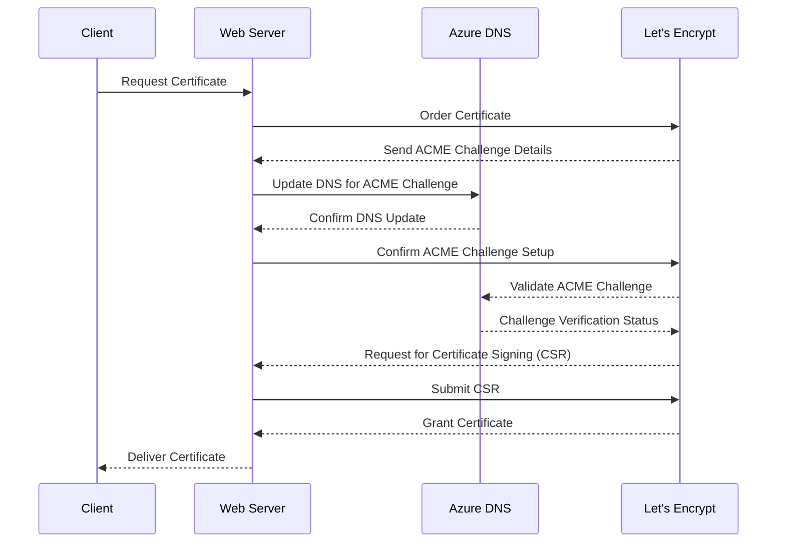

# Azure DNS as external resource for SSL ACME Challenge to bypass Ingress Firewalls


## Securing Web Services with Azure DNS: Mastering the SSL ACME Challenge

Secure web services are non-negotiable, and SSL/TLS certificates stand at the forefront of this security. While Let's Encrypt offers these certificates, procuring them becomes a complex task if your server is shielded by a firewall that filters out incoming internet traffic. The culprit? Let's Encrypt's ACME challenge requests. Thankfully, Azure DNS comes to the rescue, providing a smooth path to your solution.

### The Power of Azure DNS

Azure DNS isn't just another tool in your arsenal; it's a game-changer when you're looking to obtain SSL/TLS certificates in environments riddled with restrictions. Our guide offers a comprehensive walkthrough, equipped with necessary scripts and configurations, ensuring you overcome these challenges effortlessly.

### A Peek into the Solution

Understanding the underlying mechanism enhances implementation. Here's a schematic representation of our strategy:

```goat
           +--------+                                                              [goat]
           | Client |
           +----+---+
                |
                v
           +----+---+
           | Server |------ request certificate -----+
           +----+---+                                |
                |         +----------------+         |
                +-------->|   Firewall     + /--+    |
                |         +----------------+    |    |
                |                               |    |
                v                               |    |
           +-------+                           +-------------+
           | Azure |<--- ACME Challenge -------|Let's Encrypt|
           |  DNS  |                           +-------------+
           +-------+
```

### Flow of Certificate Request through ACME Challenge in Azure DNS

Here's a detailed flow to help you visualize the entire process:



### Implementing the Solution

To implement this solution, you'll need two main scripts: one for setting up Azure DNS with the ACME challenge and another for configuring the SSL certificate with Terraform.

#### 0. Prerequisites

Tools:
- Azure CLI (`az`)
- acme.sh CLI (`acme.sh`)

Azure resources:
- existing Azure Subscription -> `AZUREDNS_SUBSCRIPTIONID`
- existing Azure App Registration -> `AZUREDNS_APPID`
- existing Azure DNS -> `AZDNS_ZONE`

#### 1. Azure DNS with ACME Challenge Blueprint (`azure-dns-acme.sh`)

> NOTE: Code was cleaned up from anything beside critical parts:
> - Azure RBAC
> - acme.sh using Azure DNS

```bash
# Assign "DNS Zone Contributor" role in Azure
az role assignment create \
--role "DNS Zone Contributor" \
--assignee "$AZUREDNS_APPID" \
--scope "/subscriptions/$AZUREDNS_SUBSCRIPTIONID"

# ...

# Issue certificate via acme.sh using Azure DNS
acme.sh \
--issue \
--dns dns_azure \
-d "$AZDNS_ZONE"
```

### Concluding Notes

Azure DNS is your ally when conventional methods fall short. By integrating it, you not only ensure robust security with SSL/TLS certificates, even behind the most stringent firewalls, but also embrace an efficient and streamlined process. Stay updated, stay secure!


---

> Author: [Robert Grzelka](https://robert.grzelka.pl)
> URL: https://robertgrzelka.pl/blog/azure/2023-10-03-azure-dns-for-letsencrypt-acme-challenge/

