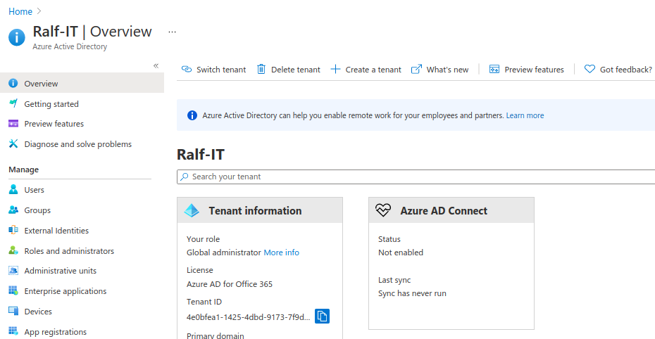

# Azure Access Control to Resources with Service Principal


# Leveraging Azure Service Principal for Efficient Subscription Management

Azure, as a cloud service, offers myriad resources and services. As these resources grow in numbers and complexity, efficient and secure management becomes paramount. This is where Azure's Service Principal, a unique identity created for use with applications, services, and automation tools, comes into play. Through this guide, you'll gain insights into how Service Principal can be a game-changer for managing access to Azure resources.

# Why Service Principal?

Traditional access control methods, although effective, sometimes don't scale well with the dynamic and automated environments that modern DevOps teams deal with. Service Principal offers a way to give specific permissions, allowing for a more granular control over resources. This way, permissions can be tailored to match exactly what an application or service needs, ensuring that the principle of least privilege is maintained.

## Benefits of Using Service Principal:

- **Automation**: Perfect for CI/CD pipelines where manual login might not be feasible.
- **Granular Control**: Assign exactly the permissions that an application or service needs.
- **Security**: Limited exposure as the permissions are specific, reducing the risk in case of any breach.

# Setting up Service Principal for Azure Resources

## Steps for Setting Access Control:

1. Create an App Registration (Service Principal).
2. Select the desired resource.
3. Assign an RBAC role to the Service Principal for the chosen resource.

## Steps for Utilizing the Granted Access Control:

1. Generate an App Registration secret, save it as variable `AAD_SECRET`.
2. Gather the App Registration's Client ID (`AAD_CLIENT_ID`) and Tenant ID (`AAD_TENANT_ID`).
3. Authenticate to the resource using these credentials via the Azure CLI (AZ CLI).

## Using Azure Portal for Service Principal Configuration

### 1. Delve into Azure Active Directory (AAD)


#### 1.1. Navigate to App Registrations



#### 1.2. Initiate a New Registration


#### 1.3. Retrieve `AAD_CLIENT_ID` and `AAD_TENANT_ID`


#### 1.4. Generate and Securely Store the Secret (`AAD_SECRET`)


<br>


### 2. Head to the Access Control Section of Your Desired Resource

#### 2.1.1. Opt for Subscription - For Inheritable Control

> NOTE: Choosing this will grant the role over the entire subscription, which is, by default, inherited by all resources within the subscription.


#### 2.1.2. Container Registry - For Singular Resource Control


### 2.2. Assign the Service Principal as the Owner


### 3. Authenticate Using Service Principal with AZ CLI

After defining permissions and collating all essential credentials, you can then proceed to authenticate your resource using the Azure CLI.

#### 3.1. Installing Azure CLI

If the Azure CLI is not yet installed on your system, you can fetch it from Microsoft's [official documentation](https://docs.microsoft.com/en-us/cli/azure/install-azure-cli).

#### 3.2. Service Principal Authentication

Execute the command below for authentication:

```bash
az login --service-principal -u [AAD_CLIENT_ID] -p [AAD_SECRET] --tenant [AAD_TENANT_ID]
```

#### 3.3. Authentication Verification

#### 3.3.1. Verification for Subscription (from 2.1.1.)

To ensure successful authentication, list your account's subscriptions:

```bash
az account list --output table
```

A correct setup will display your active subscription(s).

#### 3.3.2. Verification for Container Registry (from 2.1.2.)

After granting permissions to the Service Principal for the Azure Container Registry, it's imperative to verify that the Service Principal can indeed interact with the registry as expected. Here's how you can confirm this:

1. **List Container Registries**: Firstly, ensure that you can retrieve the list of container registries under your subscription:

```bash
az acr list --output table
```

2. **Repository Listing**: Once you identify your registry from the list, try listing its repositories. Replace `[REGISTRY_NAME]` with your container registry's name:

```bash
az acr repository list --name [REGISTRY_NAME] --output table
```

3. **Login to Registry**: An essential verification step is to confirm that you can log in to the registry using the Service Principal. Remember, this is a crucial capability, especially if you're planning to push or pull Docker images:

```bash
az acr login --name [REGISTRY_NAME]
```

If successful, you should see a message indicating a successful login. If there's an issue, the Azure CLI will return an error, which can help you diagnose any permission or configuration problems.

4. **Pull/Push Test (Optional)**: If you want to be thorough, especially if the Service Principal is meant for CI/CD operations, consider doing a test pull or push of an image. This will confirm that the Service Principal has the necessary permissions for these operations.

Remember, while testing, always use non-critical images and repositories to avoid accidental data losses or overwrites.

# Security Considerations

When using Service Principal, there are a few security best practices to keep in mind:

- **Key Rotation**: Regularly rotate and renew the secrets and keys.
- **Monitoring**: Monitor the access logs to check for any unauthorized access attempts.
- **Limit Permissions**: Only grant the permissions that are absolutely necessary.
- **Expiration**: Set secrets to expire and renew them periodically to limit the potential damage in case of leaks.

# Real-world Use Cases:

1. **DevOps Pipelines**: Automate deployments and manage Azure resources without manual intervention.
2. **Third-party Access**: Grant third-party applications limited access to specific resources without exposing your entire Azure setup.
3. **Scheduled Jobs**: For applications that run on schedules and require access to Azure resources.

# Troubleshooting Tips

Setting up Service Principal is generally straightforward, but here are a few common issues:

1. **Permission Denied**: Ensure that the Service Principal has the required permissions and that there's no overriding deny assignment.
2. **Authentication Failures**: Double-check the `AAD_SECRET`, `AAD_CLIENT_ID`, and `AAD_TENANT_ID`. Any mismatch can result in failures.
3. **Resource Access Issues**: Ensure that the RBAC role assigned to the Service Principal matches the required access level for the resource.

# Further Reading

For those keen on diving deeper into Service Principal and its intricacies, here are a few recommended readings:

1. [Azure's official documentation on Service Principal](https://docs.microsoft.com/en-us/azure/active-directory/develop/app-objects-and-service-principals)
2. [Best practices for managing and accessing Azure resources](https://docs.microsoft.com/en-us/azure/azure-resource-manager/management/best-practices-resource-manager)
3. [Azure CLI documentation for advanced users](https://docs.microsoft.com/en-us/cli/azure/?view=azure-cli-latest)

# Wrapping Up

Service Principal stands as a testament to Azure's commitment to providing flexible and secure ways to manage its resources. By integrating it into your workflow, you not only streamline access control but also bolster your security stance. As always, your feedback and insights are invaluable. Please share your thoughts in the comments below and join me in exploring more Azure features in upcoming posts. Happy Azure managing!

---

> Author: [Robert Grzelka](https://robertgrzelka.pl)
> URL: https://robertgrzelka.pl/blog/azure/azure-access-control-to-resources-with-service-principal/

